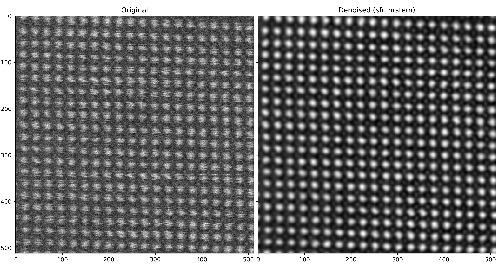

# Denoise/Restore Electron-Microscopy Images using the `r_em` Deep-Learning Model by Lobato et al.

This notebook contains ideas for denoising workflows using the model and guidelines from the official repository (https://github.com/Ivanlh20/r_em).  
It shows how to use `tifffile` to load TIFF images, denoise/restore them, and save them back to TIFF.  

*Note:* Only `sfr_hrstem` and `sfr_lrstem` are installed with pip. Other models must be download from the [repository](https://github.com/Ivanlh20/r_em/tree/master/tk_r_em/models) ([download link](https://download-directory.github.io?url=https://github.com/Ivanlh20/r_em/tree/master/tk_r_em/models) for all models) and copied into the package folder in the Python environment (e.g., `...\Miniconda3\envs\YOUR_ENV\Lib\site-packages\tk_r_em\models`). 

**Please cite their work in your publications if it helps your research:**
```bibtex
@article{Lobato2023,
   author = {I. Lobato and T. Friedrich and S. Van Aert},
   month = {3},
   title = {Deep convolutional neural networks to restore single-shot electron microscopy images},
   url = {https://arxiv.org/abs/2303.17025v1},
   year = {2023},
}
```


